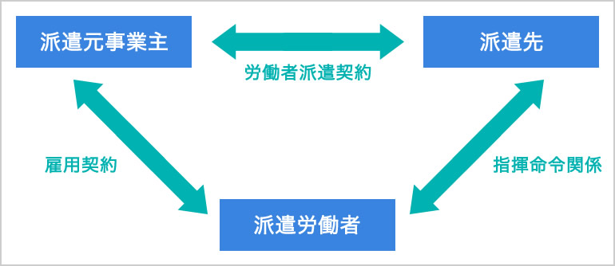

## 法務
用語 | 説明 | 例・備考
:- | :- | :-
コーポレートガバナンス | 例えば、企業の活動を株主などの利害関係者が監視する仕組み
著作権 | 思想や感情を表現したもの | アルゴリズムや規約は著作権ではない　作者の死後70年有効
特許法 | 物や技術の発明を保護(パクられないように)するもの
ビジネスモデル特許 | ビジネスに関係する技術的な工夫や発明を保護するもの | 例: Amazonのワンクリック注文
意匠権 | 量産可能な、形や模様などのデザインに対して認められる権利
不正競争防止法 | 同じ商品やサービスを提供する企業同士が不正な方法で他の企業に勝とうとするのを防ぐ法律
クロスライセンス | 企業が互いに持つ特許の使用権を互いに許諾すること
不正アクセス禁止法 | ネットワークから不正なログインや侵入やそれを助長する行為を禁止する法律
個人情報保護法 | 氏名、生年月日、住所などの個人情報を識別する情報を保護する法律
労働者派遣法 | 待遇や労働条件などの派遣労働者の権利を守る法律
JANコード | バーコード規格の一つで、製造事業者と商品を識別するためのもの　一意性(他のコードと被らないこと)が確保されている
商標法 | 企業や商品のロゴや名称などの使用を保護する法律
システム管理基準 | 情報システムにおけるリスクのコントロールを適切に行うための基準 | リスク: 不正アクセス、機器の故障、災害など
プロバイダ責任制限法 | 不特定多数が閲覧できるサービスにおいて、名誉棄損等で他人の権利が侵害された場合に、そのサービスの運営者が責任を負わなくてもいい代わりに、被害者が運営者に対して削除を求めた場合に速やかにその請求に応じる義務がある　また、運営者に対して侵害者の身元情報の開示を請求することができる
労働基準法 | 労働者に対しての賃金や労働時間などについての最低基準を定めた法律
特定商取引法 | 訪問販売や通信販売などの取引において事業者が守るべきルールについて定めた法律 | 通信販売: 電話やインターネットなどを通じて商品を注文すること
製造物責任法 | 製造物の欠陥により、人体や財産に被害を及ぼした場合の製造者の損害賠償責任について定めた法律
コンプライアンス | 倫理や法令などを遵守すること | 倫理: 人として守るべきこと
公益通報者保護法 | 勤務先の法律違反を通報したことを理由とする解雇などを禁止する法律
デファクトスタンダード | 規格として定められていないが、企業のシェアなどを理由に広く使われているもの | 例: Excelは標準として使うと定められていないが、多くの企業でExcelを使っている
QRコード | 縦と横に情報を持ったバーコード規格の一つで、あらゆる文字を格納することができる | どの方向からでも読み取ることができる
IEEE | 電気分野における世界最大の組織で、有線LANや無線LANなどの規格を策定している
JIS(日本産業規格) | 工業分野における基準となる規格を定めたもの
ISO14000 | 環境マネジメントシステム　企業が環境に対してどのような良い取り組みをするかを定めた規格
ISO9000 | 品質マネジメントシステム　製品やサービスの品質を管理し、顧客満足度を向上させるための規格
情報公開法 | 行政機関が保有する情報の公開を国民が請求することができる法律
GDPR | ヨーロッパで施行されている、個人情報を保護するための法律
実用新案権 | 物の形や構造、組み合わせに関する案に対して適用される権利
フォーラム基準 | 特定の分野に対して専門家が集まり、その技術についての標準を定めたもの
要配慮個人情報 | 人種や信教、犯罪履歴などの、不当な差別が生じるような特に注意すべき情報のこと
限定提供データ | 特定の条件や目的でのみ利用が許可される情報
JIS38500 | ITガバナンス(情報システムの導入や運用を管理・監視すること)の規格
請負契約 | 仕事の達成を約束し、その対価を支払うことを定めた法律

#### 派遣について

派遣労働者から見て「雇用関係」は派遣元企業、「指揮命令関係」は派遣先企業にあたる。
派遣された労働者を別の企業にさらに派遣させる「二重派遣」は違法。