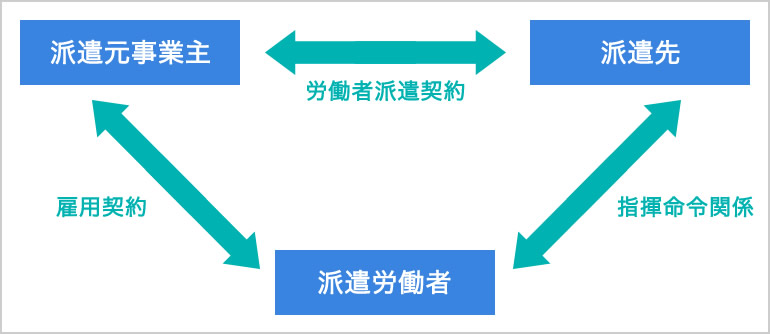

## 法務
用語 | 説明 | 例・備考
:- | :- | :-
コーポレートガバナンス | 例えば、企業の活動を株主などの利害関係者が監視する仕組み
著作権 | 思想や感情を表現したもの | アルゴリズムや規約は著作権ではない　作者の死後70年有効
特許法 | 物や技術の発明を保護(パクられないように)するもの
ビジネスモデル特許 | ビジネスに関係する技術的な工夫や発明を保護するもの | 例: Amazonのワンクリック注文
意匠権 | 量産可能な、形や模様などのデザインに対して認められる権利
不正競争防止法 | 企業が他の企業との競争(同じ商品やサービスを提供する企業同士)で正しいルールを守って活動するように促し、不正な方法で他の企業に勝とうとするのを防ぐ法律
クロスライセンス | 企業が互いに持つ特許の使用権を互いに許諾すること
不正アクセス禁止法 | ネットワークから不正なログインや侵入やそれを助長する行為を禁止する法律
個人情報保護法 | 氏名、生年月日、住所などの個人情報を識別する情報を保護する法律
労働者派遣法 | 待遇や労働条件などの派遣労働者の権利を守る法律
JANコード | バーコード規格の一つで、製造事業者と商品を識別するためのもの　一意性(他のコードと被らないこと)が確保されている
商標法 | 企業や商品のロゴや名称などの使用を保護する法律
システム管理基準 | 情報システムにおけるリスクのコントロールを適切に行うための基準 | リスク: 不正アクセス、機器の故障、災害など
プロバイダ責任制限法 | 不特定多数が閲覧できるサービスにおいて、名誉棄損等で他人の権利が侵害された場合に、そのサービスの運営者が責任を負わなくてもいい代わりに、被害者が運営者に対して削除を求めた場合に速やかにその請求に応じる義務がある　また、運営者に対して侵害者の身元情報の開示を請求することができる

#### 派遣について

派遣労働者から見て「雇用関係」は派遣元企業、「指揮命令関係」は派遣先企業にあたる。
派遣された労働者を別の企業にさらに派遣させる「二重派遣」は違法。