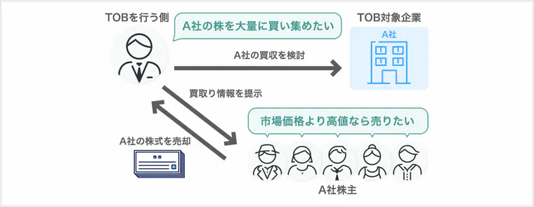

## 経営戦略マネジメント
用語 | 説明 | 例・備考
:- | :- | :-
SWOT分析 | 自社から見た外部環境(機会、脅威)と内部環境(強み、弱み)に分けて分析すること
PPM | 市場成長率と市場占有率の二つの軸からなる表　自社の製品やサービスを分類することにより、資源の配分を判断することができる
アウトソーシング | 自社の業務を外部業者へ委託すること
TOB | 対象企業の経営権を取得するために、株の価格や期間などを提示して、市場外から買い集めること
RFM分析 | 顧客情報から「最新購買日」「購買頻度」「購買金額」を参考にして顧客の購買行動を分析すること
BSC | 財務、顧客、業務プロセス、学習と成長の4つの視点から業績を分析すること
バリューエンジニアリング | 製品やサービスを提供する価値と、機能とコストとのバランスを取りながら、できるだけ少ないコストで機能を実装すること
CRM | 顧客の満足度を高めて長期的な関係を築くことを重視する方法
SCM | 生産から販売までのプロセスを一元管理して、最適化を図る方法　納期の短縮や在庫の削減の効果が見込まれる
ERP | 人材や設備などの資源を一元管理して、業務の最適化を図る手法
コアコンピタンス | 他社にはまねできない企業独自の技術やノウハウ
ニッチ戦略 | 市場の競争を避け、特定の分野に特化した製品やサービスを提供する戦略
アライアンス | 企業同士が特定の目的(営業力、技術力など)のために協力関係を築くこと
M&A | 買収により他社の資源を自社に取り込むこと
MBO | 経営陣が経営権を取得するために自社の株を買うこと
コモディティ化 | メーカーごとの製品の差異がほとんどなくなり、価格以外で差がつかなくなる状態
プロダクトライフサイクル | 導入期(認知度の向上) → 成長期(他社との差別化) → 成熟期(製品改良) → 衰退期(衰退時期の判断)のサイクルのこと
セグメントマーケティング | 市場にいるユーザをグループ化し、そのグループごとにマーケティングを行う手法
インバウンドマーケティング | 検索やSNSなどを使用して顧客側から企業に興味を持ってもらい、自然に引き寄せる手法
プル戦略 | 広告やSNSなどを通じて顧客に商品を購買するきっかけを与える方法
SEO | 自社のウェブページが検索結果の上位に表示されるように工夫すること
アフィリエイト | 企業から提供される広告をブログなどに掲載し、その広告経由で売上が発生すると報酬が支払われる仕組み
レコメンデーション | 顧客の購入履歴から好みそうな商品などをおすすめに表示する仕組み
KPI | 経営の最終目標を達成するための各プロセスにおいての目標を数値化したもの | 製品の欠品率1%未満など
CSF | 経営目標を達成する上での重要な影響を及ぼす要因のこと
バリューチェーンマネジメント | 製品の付加価値がどの過程で生み出されているかを分析し、全体のプロセスを最適化する方法
ナレッジマネジメント | 個人が持つ情報や知識、経験などを企業内で共有すること
KGI | 企業が目指す最終的な目標を数値化したもの | 年商1億円など
経営戦略 | 経営の目的を達成するための方針や計画
ロジスティックス | 物流(在庫管理、配送など)を計画、管理することで最適化を図る手段のこと
OEM | 他社が自社ブランドの製品を製造すること
CAD | コンピュータを用いて設計・製図をすること
CAM | 生産ラインをコンピュータを用いて制御すること
エスクローサービス | 取引の不正を防止するために、取引が行われる際に第三者が仲介するサービス | メルカリなど、仲介役は人でなくてもいい

#### TOB

#### プッシュ戦略とプル戦略の違い
- **プッシュ戦略**
  - 顧客に商品を直接的に売り込む方法
    - 訪問販売、メルマガ
- **プル戦略**
  - 顧客に商品を買うきっかけを与える方法
    - SNSやブログで商品の魅力を紹介する

#### 価値と付加価値の違い
スマホで例えると、
- **価値**
  - スマホが持つ通話機能やメール機能などの基本的な要素
- **付加価値**
  - 高画質カメラ、長時間バッテリー、デザインなどの他社と差別化する要素
